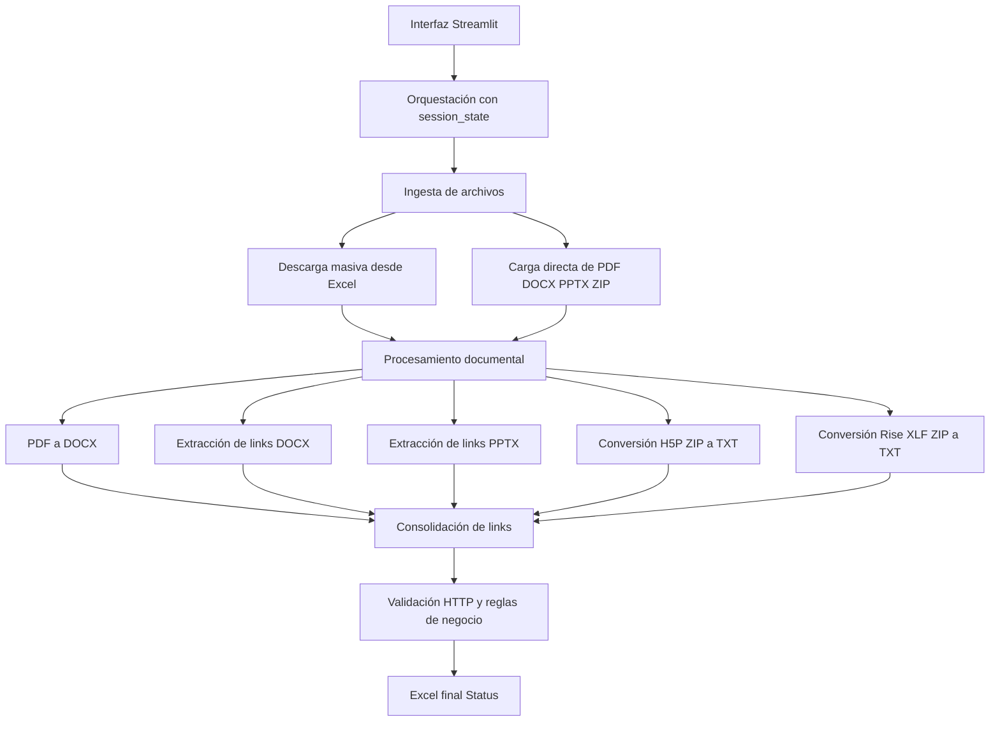

# UTP - Broken Link Checker

Aplicativo web desarrollado en **Streamlit** para **detectar enlaces rotos** en documentos académicos y administrativos, reducir la revisión manual y generar un **reporte final en Excel** con estado **ACTIVO/ROTO**.

---

## Descripción general

**UTP - Broken Link Checker** automatiza un proceso que normalmente consume mucho tiempo:

1. recibe un **Excel con URLs** de documentos,
2. descarga automáticamente archivos compatibles,
3. procesa documentos **PDF, Word, PowerPoint, H5P y XLF/Rise**,
4. extrae los enlaces detectados,
5. valida si cada enlace sigue activo,
6. entrega un **Excel final de status** para revisión y corrección.

Está pensado para equipos académicos, áreas de calidad, producción de contenidos y usuarios que necesitan verificar material digital antes de su publicación o distribución.

---

## ¿Qué problema resuelve?

En entornos académicos y documentales, los enlaces rotos generan:

- mala experiencia del usuario final,
- pérdida de tiempo en validaciones manuales,
- materiales desactualizados,
- reprocesos operativos.

Esta herramienta centraliza el flujo en una sola pantalla y convierte la revisión de enlaces en un proceso **más rápido, repetible y trazable**.

---

## ¿Para quién está pensado?

### Usuarios no técnicos

El aplicativo permite:

- cargar archivos desde la interfaz,
- ejecutar el flujo sin programar,
- visualizar progreso y estados,
- descargar reportes finales listos para revisión.

### Usuarios técnicos

El proyecto también está preparado para:

- mantener un pipeline de procesamiento en **etapas**,
- reutilizar resultados con `st.session_state`,
- separar lógica principal y helpers por tipo de contenido,
- extender reglas de validación de enlaces por dominio, tipo de archivo o contexto institucional.

---

## Módulos del aplicativo

La aplicación tiene **2 módulos principales**:

### 1. Home

Pantalla informativa que explica:

- propósito del sistema,
- cobertura de formatos,
- funcionalidades principales,
- flujo de trabajo,
- lineamientos de seguridad y privacidad.

### 2. Report Broken Link

Módulo operativo principal. Aquí se ejecuta el pipeline completo de análisis.

---

## Flujo funcional del aplicativo

El flujo puede entenderse en **4 grandes fases**:

### Fase 1. Ingesta y descarga

- Se carga un **Excel** con columna `url`.
- El sistema identifica enlaces que terminan en formatos permitidos.
- Descarga automáticamente documentos **PDF, DOCX y PPTX**.
- Genera también un **CSV de fallidos** cuando alguna descarga no puede completarse.

### Fase 2. Carga documental

Además de la descarga masiva, el usuario puede cargar directamente:

- **PDF**,
- **DOCX**,
- **PPTX**,
- **ZIP** con contenidos **H5P**,
- **ZIP** con contenidos **XLF / Rise**.

### Fase 3. Extracción y preparación

- Los **PDF** se transforman a **DOCX** para facilitar el análisis.
- Los **DOCX** y **PPTX** se recorren para detectar URLs visibles e hipervínculos incrustados.
- Los paquetes **H5P** y **Rise/XLF** se convierten a **TXT** mediante helpers especializados.
- Todos los resultados se consolidan en un **reporte de links detectados**.

### Fase 4. Validación y reporte

- Se normalizan enlaces.
- Se descartan formatos inválidos.
- Se consulta el estado HTTP de cada URL.
- Se aplican reglas de clasificación avanzada:
  - enlaces activos,
  - rotos reales,
  - soft-404,
  - accesos restringidos,
  - errores transitorios,
  - dominios validados manualmente.
- Finalmente se genera un **Excel Status** con el resultado final.

---

## Flujo explicado para usuarios no técnicos

```text
Excel con URLs
   ↓
Descarga automática de documentos
   ↓
Carga y procesamiento de archivos
   ↓
Extracción de links
   ↓
Validación automática de enlaces
   ↓
Excel final con estado ACTIVO / ROTO
```

---

## Arquitectura explicada de forma sencilla

La arquitectura se puede entender en **5 capas**.

### 1. Capa de interfaz

Es la parte visible para el usuario.

Incluye:

- sidebar,
- módulos,
- expanders,
- métricas,
- barras de progreso,
- chips de estado,
- botones de descarga,
- tablas de resultados.

### 2. Capa de orquestación

Controla el flujo del proceso usando `st.session_state`.

Esta capa decide:

- qué pasos ya terminaron,
- qué resultados deben reutilizarse,
- cuándo reiniciar el pipeline,
- qué archivos están disponibles en cada etapa.

### 3. Capa de ingesta y archivos

Se encarga de recibir archivos desde:

- carga manual,
- descargas masivas,
- ZIP con contenidos estructurados.

También organiza directorios temporales y rutas de trabajo.

### 4. Capa de procesamiento documental

Transforma y analiza los documentos:

- PDF → DOCX,
- lectura de Word,
- lectura de PowerPoint,
- extracción de texto desde H5P,
- extracción de texto desde XLF / Rise.

### 5. Capa de validación y salida

Aplica la lógica de validación de enlaces y genera la salida final:

- normalización de URLs,
- validación estructural,
- verificación HTTP,
- heurísticas de soft-404,
- whitelist institucional,
- exportación del reporte en Excel.

---

## Arquitectura técnica



---

## Archivos principales del proyecto

### `app.py`

Archivo principal del aplicativo en producción.

Responsabilidades:

- configuración de Streamlit,
- render de módulos,
- control del flujo unificado,
- persistencia de estado,
- procesamiento de descargas,
- extracción de links,
- validación final,
- exportación de reportes.

> En la versión analizada de esta documentación, el archivo principal corresponde al script cargado como `brokenCheck.py`.

### `brokenCheck_h5p_helper.py`

Helper especializado para paquetes **H5P**.

Responsabilidades:

- abrir ZIPs H5P,
- detectar archivos `.h5p` y reportes Excel asociados,
- extraer texto útil desde JSON, HTML y TXT internos,
- generar archivos `.txt` por contenido,
- construir un **reporte H5P unificado**,
- extraer links desde los TXT generados.

### `brokenCheck_rise_helper.py`

Helper especializado para paquetes **Rise / XLF / XLIFF / XML**.

Responsabilidades:

- abrir ZIPs de Rise,
- detectar archivos XLF/XLIFF/XML,
- parsear contenido de etiquetas `source`, `target` y `seg-source`,
- convertir contenido a TXT,
- leer reportes Excel `reporte_rise_*`,
- generar un **reporte Rise unificado**,
- extraer links desde los TXT procesados.

---

## Componentes técnicos clave

### Gestión de estado

Funciones importantes:

- `init_session_state()`
- `reset_report_broken_pipeline()`

Su función es mantener el flujo estable y evitar reprocesos innecesarios entre pasos.

### Procesamiento de PDFs

Clase principal:

- `PDFBatchProcessor`

Permite:

- procesar múltiples PDFs,
- usar procesamiento paralelo por páginas,
- convertir PDFs a DOCX,
- preservar el texto para etapas posteriores.

### Extracción de links

Funciones relevantes:

- `_extract_links_from_docx_bytes()`
- `_extract_links_from_pptx_bytes()`
- `_extract_links_from_pdf_path()`
- `run_h5p_txt_link_report_streamlit()`
- `run_rise_txt_link_report_streamlit()`

### Validación de enlaces

Funciones relevantes:

- `_normalize_links()`
- `_check_one_url_robust_v5()`
- `_run_link_check_ultra_v5()`
- `_infer_tipo_problema()`
- `_standardize_status_column()`

### Exportación

Funciones relevantes:

- `_to_excel_report()`
- `_to_excel_reporte_links()`

---

## Formatos de entrada soportados

### Entrada principal

- Excel `.xlsx` / `.xls` con columna `url`

### Documentos

- `.pdf`
- `.docx`
- `.pptx`

### Paquetes comprimidos

- `.zip` con contenidos **H5P**
- `.zip` con contenidos **Rise / XLF / XLIFF / XML**
- `.zip` con colecciones de documentos compatibles

---

## Archivos de salida

El sistema puede generar los siguientes artefactos:

- ZIP con documentos descargados,
- CSV de descargas fallidas,
- DOCX generados desde PDFs,
- TXT procesados desde H5P,
- TXT procesados desde Rise,
- Excel unificado H5P,
- Excel unificado Rise,
- Excel final **Status** con el estado de cada enlace.

---

## Estructura del reporte final

La hoja principal de salida consolida información como:

- `name`
- `Archivo`
- `Página/Diapositiva`
- `Link`
- `Status`
- `HTTP_Code`
- `Detalle`
- `Tipo_Problema`
- `link_class`
- `source_url`

Esto permite revisar no solo si el enlace está activo o roto, sino también **de dónde proviene** y **qué tipo de problema se detectó**.

---

## Lógica de validación destacada

El checker no se limita a revisar un código HTTP.

También incorpora lógica adicional para reducir falsos positivos:

- validación de estructura de URL,
- detección de enlaces truncados,
- validación específica para YouTube y X/Twitter,
- descarte de búsquedas de Google como enlaces finales,
- revisión de `Content-Type` esperado,
- detección de **soft-404**,
- tratamiento especial para dominios confiables,
- **lista blanca institucional** para URLs aprobadas manualmente,
- tratamiento especial para `canvas.utp`, que se marca como roto por regla de negocio.

---

## Decisiones técnicas importantes del diseño

### Persistencia por sesión

La app usa `st.session_state` para:

- evitar ejecuciones repetidas,
- mantener archivos intermedios disponibles,
- preservar resultados entre pasos,
- soportar reinicio controlado del pipeline.

### Procesamiento por rutas en disco

En lugar de depender solo de objetos en memoria, la aplicación trabaja con **rutas temporales en disco** para mejorar estabilidad y manejo de archivos grandes.

### Enfoque modular

La lógica especializada de H5P y Rise está separada en helpers, lo que facilita:

- mantenimiento,
- pruebas,
- evolución por tipo de contenido,
- menor acoplamiento del script principal.

---

## Requisitos técnicos

### Python

Se recomienda usar **Python 3.10 o superior**.

### Dependencias principales

- `streamlit`
- `pandas`
- `requests`
- `httpx`
- `pymupdf`
- `python-docx`
- `python-pptx`
- `openpyxl`

---

## Ejecución local

```bash
pip install -r requirements.txt
streamlit run app.py
```

Si en tu entorno el archivo principal conserva el nombre actual, ejecuta:

```bash
streamlit run brokenCheck.py
```

---

## Recomendaciones operativas

Para un uso más estable en producción:

- procesar entre **500 y 700 URLs** por ejecución en Streamlit Cloud,
- dividir archivos muy grandes en bloques cuando sea necesario,
- procesar archivos **H5P** muy pesados de forma independiente,
- validar dependencias instaladas antes de desplegar,
- conservar una estructura clara de carpetas temporales y salida.

---

## Seguridad y privacidad

El aplicativo fue diseñado con un enfoque conservador de procesamiento:

- no depende de almacenamiento permanente de documentos del usuario,
- utiliza archivos temporales de trabajo,
- limita la persistencia a la sesión de Streamlit,
- permite trazabilidad de fallos sin exponer más información de la necesaria.

---

## Casos de uso típicos

- revisión de sílabos o materiales académicos antes de publicación,
- control de calidad de enlaces en documentos institucionales,
- verificación de repositorios documentales descargados desde Excel,
- consolidación de enlaces de contenidos exportados desde H5P y Rise.

---

## Problemas frecuentes

### El Excel no procesa

Verifica que el archivo contenga la columna obligatoria `url`.

### No se descargan documentos

Revisa si las URLs terminan en formatos permitidos:

- `.pdf`
- `.doc`
- `.docx`
- `.ppt`
- `.pptx`

### Los ZIP H5P o Rise no generan resultados

Confirma que el ZIP contenga:

- archivos válidos del paquete,
- y, si aplica, reportes Excel con la estructura esperada.

### El proceso consume mucha memoria en cloud

Divide el trabajo en lotes más pequeños o ejecuta el aplicativo en local.

### Un enlace parece válido pero figura como roto

Puede deberse a:

- reglas institucionales,
- contenido protegido por anti-bot,
- soft-404,
- redirecciones no válidas,
- errores de contenido devuelto por el servidor.

---

## Recomendaciones de mantenimiento del README

Este README debería actualizarse cuando cambie alguno de estos puntos:

- flujo del pipeline,
- formatos soportados,
- estructura del Excel final,
- reglas de validación,
- helpers disponibles,
- limitaciones operativas del entorno cloud.

---

## Roadmap sugerido

Mejoras recomendadas para futuras versiones:

- separar todavía más la UI de la lógica de negocio,
- agregar pruebas automáticas para validación y extracción,
- documentar ejemplos reales de entrada y salida,
- centralizar configuraciones de dominios en un archivo independiente,
- añadir carpeta `/docs` con diagramas visuales de arquitectura.

---

## Licencia

Define aquí la licencia del proyecto según tu política interna:

- uso interno institucional,
- MIT,
- Apache 2.0,
- u otra aplicable.

---

## Autor

**José Luis Antúnez Condezo**

Proyecto orientado a automatización documental, validación de enlaces y mejora de calidad en contenidos académicos.
